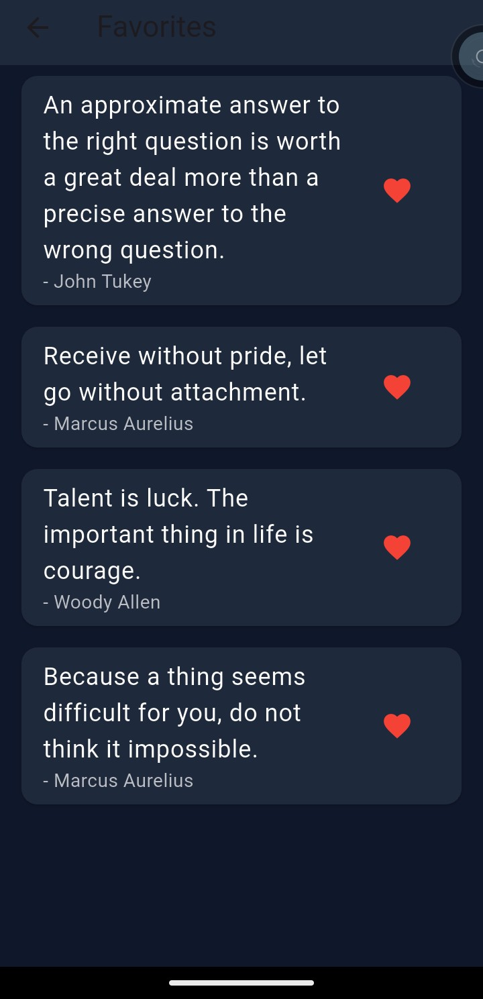

# 📱 Random Quote Generator App

A modern Flutter-based quote application developed as part of the **CodeAlpha App Development Internship**.

The app generates inspirational quotes using an API and allows users to save their favorite quotes locally, search through quotes, and share them with others through a clean and responsive interface.

---

## ✨ Features

* 🎲 Generate Random Quotes
* ❤️ Save Favorite Quotes
* 🔍 Search Quotes
* 📂 Browse Quotes by Categories
* 📤 Share Quotes with Friends
* 💾 Offline Favorites using Hive Database
* 🌙 Dark Mode Support
* 🎨 Clean & Responsive UI

---

## 🛠️ Tech Stack

* Flutter
* Dart
* Quote API
* Hive Database
* Provider
* Material Design

---

## 📸 App Screenshots

### 🏠 Home Screen

<p align="center">
  
</p>

### ❤️ Favorites Screen

<p align="center">
  
</p>

### 📤 Share Quote Feature

<p align="center">
  
</p>

---

## 🚀 Getting Started

Clone the repository:

```bash
git clone https://github.com/fatima-awais1122/random_quote_generator.git
```

Install dependencies:

```bash
flutter pub get
```

Run the application:

```bash
flutter run
```

---

## 👩‍💻 Developed By

**Fatima Awais**

---

## 📄 License

This project was developed for learning purposes as part of the **CodeAlpha App Development Internship**.
